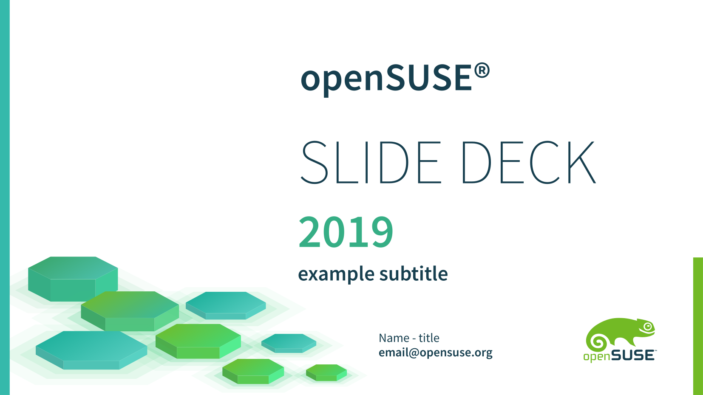

# Greenhex 0.1

Libre Office Impress Theme for openSUSE

## Required

- libreoffice
- adobe-sourcesanspro-fonts
- fontawesome-fonts

### Install in openSUSE

`$ sudo zypper in libreoffice adobe-sourcesanspro-fonts fontawesome-fonts`
    
## Features
- animation
- no bitmap (fully editable)
- lightweight

## Slide
- 1 title
- 5 article
- 10 welcome-message
- 4 team profile
- 8 portofolio
- 5 table slide
- 2 pricing plan
- 2 result slide
- 7 chart slide
- 2 proceed and timeline
- 10 device mockup
- 2 run process
- 11 infographic slides
- 2 section/break
- 1 finish

## On going...

- transition
- new infographic
- new country maps
- dark version
